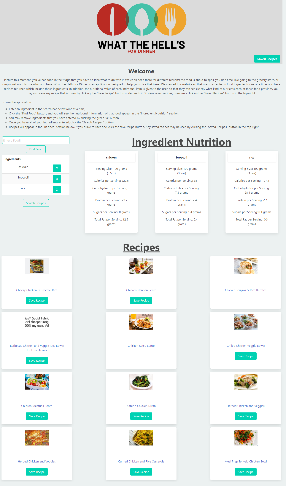
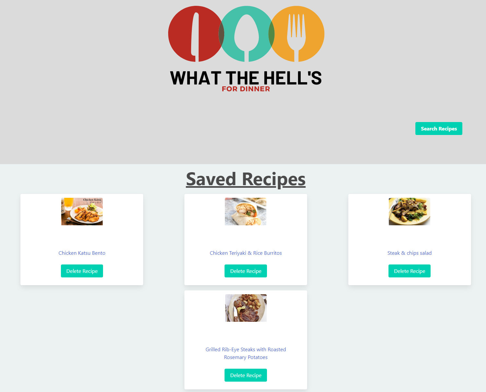

# What the Hell's for Dinner

## Description
For many reasons, people are always struggling to use things in their fridge. Whether it be those ingredients are about to go bad, they do not want to go to the grocery store, or anything else, it happens. What the Hell's for Dinner (WTHFD) is an application designed to help users solve that problem. By inserting ingredients, users can not only see the nutritional value of those ingredients, but also find recipes online to use those ingredients. Not only that, but those recipes can also be saved and stored in local storage to return to at a later date if desired. 

## Table of Contents

N/A

## Installation

No installation required

## Usage

To use WTHFD, it is very simple. On the website, you will find an input box to search for foods or ingredients one at a time. By clicking the find food button after entering an ingredient, the user will see its nutritional value returned using API Ninjas' Nutrition API. As many ingredients as desired can be entered, but the more ingredients entered the more specific the recipes will be. If the user would like to remove an ingredient, they may do so by simply clicking the "X" next to the ingredient name after being searched. Once all of the ingredients are entered, users can then click the "Search Recipes" button to find recipes. For this, the Spoonacular API was used twice. Once to get the recipe IDs, and then again to use those IDs to find the recipes and display that information. Each recipe has a link to go to the webpage of that recipe. In addition, recipes may be saved to the user's local storage to refer to later. To view their saved recipes, users can click on the "Saved Recipes" button in the top-right of the webpage. For styling, we used the Bulma API as much as possible.

Link to the deployed application: https://figgersrm.github.io/WTHFD/

## Credits

API Ninjas Nutrition API: https://api-ninjas.com/api/nutrition

Spoonacular API for recipes: https://spoonacular.com/food-api/docs

Bulma for styling: https://bulma.io/documentation/

## Notes for Future Development

These are some things that could be added to the application in the future to run more optimally:

* The Spoonacular API allows users to be more specific with their recipe search, such as minimizing missing ingredients, maximizing ingredients-on-hand, allowing them to select how many recipes they would like returned, and whether to ignore pantry items such as water, flour, salt, etc.

* When using the Spoonacular API, some of the recipes that are returned have links that give 404 errors when clicked. Ideally, that would not happen with the recipes that are displayed to the user.

* On the saved recipes page, add a "clear all" button that would clear all of the user's saved recipes.

* On the main page, add a button near the bottom to take users to the saved recipes page, so that they wouldn't have to scroll to the top of the webpage.

* When no recipes are found, add a modal to notify the user in a similar way when the ingredient is not found.

## License

N/A

## Application Image

Below are images of the deployed application:

Main page where recipes are searched:

Saved Recipes Page:

